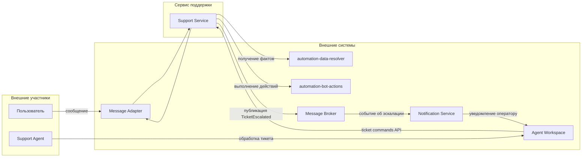
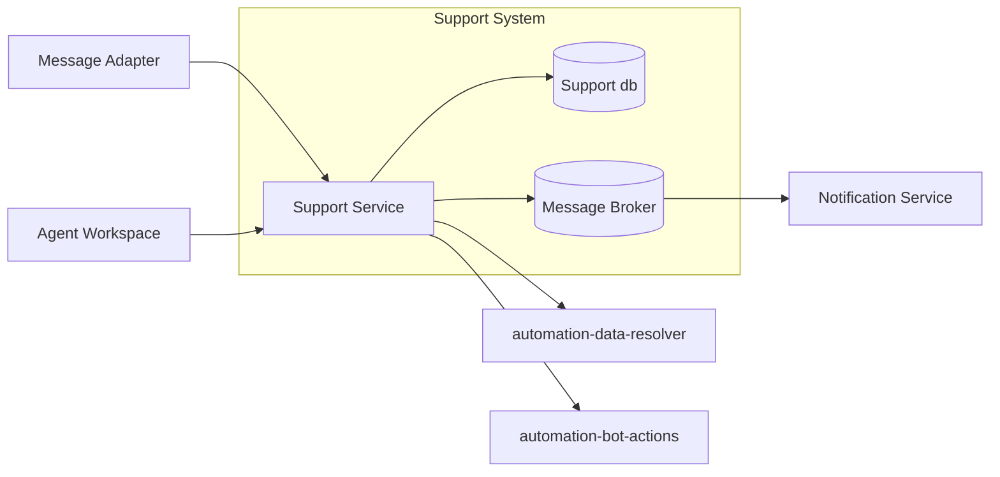
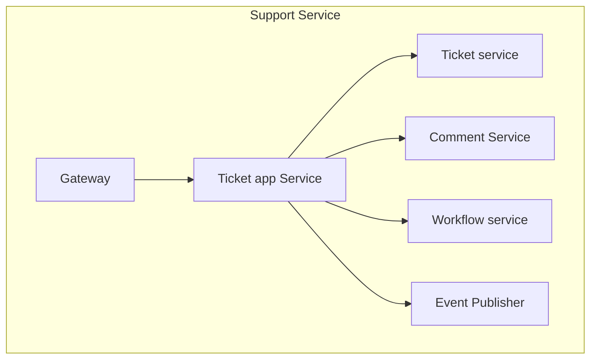
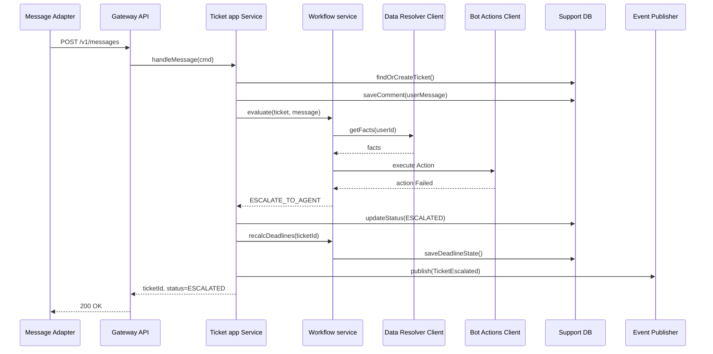

# Лабораторная работа 1 - Декомпозиция и взаимодействие компонентов
## Проект: Сервис поддержки пользователей

## 1. Краткий контекст проекта

Сервис поддержки пользователей управляет тикетами, их жизненным циклом и коммуникацией между пользователем,
чат-ботом и сотрудником поддержки.

Основная цель сервиса - принять обращение пользователя, сохранить его в виде тикета, попытаться обработать его
автоматически и, если это невозможно или нецелесообразно, передать обращение на ручную обработку сотруднику поддержки.

Сотрудник поддержки разбирает эскалированные обращения, уточняет детали у пользователя, меняет статус тикета и
завершает обработку в случаях, когда автоматического сценария недостаточно.

### Участники процесса

- **Пользователь** - отправляет сообщение или запрос в поддержку.
- **Чат-бот** - выполняет первичную автоматическую обработку обращения по сценарию.
- **Агент поддержки** - сотрудник поддержки, который вручную разбирает сложные обращения и завершает обработку тикета.
- **Администратор / менеджер поддержки** - настраивает правила маршрутизации, SLA и контролирует качество обработки.

### Жизненный цикл тикета

Для упрощения в работе используется следующий жизненный цикл тикета:

- NEW - тикет создан, но еще не взят в обработку
- IN_PROGRESS - обращение обрабатывается ботом или агентом
- WAITING_USER - для продолжения нужен ответ пользователя
- ESCALATED - обращение передано агенту поддержки
- RESOLVED - проблема решена
- CLOSED - тикет закрыт окончательно

Такой набор статусов достаточно прост для защиты и покрывает типовой процесс поддержки без лишнего усложнения.

### Примеры бизнес-сценариев

#### Позитивный сценарий

Пользователь пишет: «Где мой заказ?». Сервис создает или находит тикет, запрашивает факты о пользователе и заказе через
automation-data-resolver, определяет, что заказ уже передан в доставку, и бот автоматически отвечает пользователю без
перевода обращения на агента.

#### Негативный сценарий

Пользователь пишет о проблеме, которую нельзя обработать автоматически, либо внешний automation-сервис не может вернуть
достаточно данных. В этом случае обращение эскалируется, тикет переводится в статус ESCALATED, и дальнейшую обработку
берет на себя агент поддержки.

В рамках этой лабораторной предполагается, что обращение в поддержку создает только идентифицированный пользователь.
Анонимные обращения не рассматриваются.

### Что такое факты и экшены в контексте проекта

В проекте автоматизации поддержки используются два важных понятия:

- **Факты** - это структурированные данные, на основании которых бот или workflow принимает решение о дальнейшей
  обработке обращения. Примеры фактов - статус пользователя, наличие активного заказа, последний статус заказа,
  признаки блокировки, доступность определенного сценария.
- **Экшены** - это действия, которые бот может инициировать во внешних системах в рамках сценария. Примеры экшенов -
  создать обращение во внешней системе, отвязать телефон, запустить дополнительную проверку или выполнить сервисную
  операцию от имени сценария.

В рамках этой лабораторной сервис поддержки не вычисляет факты сам и не выполняет внешние действия напрямую. Для этого
он использует две внешние интеграции:

- automation-data-resolver - возвращает факты, нужные для автоматического решения
- automation-bot-actions - выполняет разрешенные экшены

## 2. Декомпозиция системы

### Декомпозиция функциональности

1. **Ticket Management**
   - создание и управление состоянием тикета
   - назначение исполнителя
   - закрытие тикета
2. **Deadline Policy**
   - расчет дедлайнов
   - контроль просрочек
3. **Comment / History**
   - хранение сообщений, системных комментариев и журнала изменений
4. **Workflow**
   - правила маршрутизации входящих обращений
   - выбор сценария обработки - автоответ, запрос дополнительных данных, эскалация на агента
   - перевод на агента в сложных случаях

### Декомпозиция по владению данными

- **Ticket Management** - хранит и меняет данные тикета
- **Deadline Policy** - хранит правила расчета дедлайнов и состояния SLA
- **Comment / History** - хранит сообщения и историю изменений
- **Workflow** - хранит правила маршрутизации обращений между автоматической обработкой и ручной обработкой агентом

### Декомпозиция по ролям

- **Пользователь** создает обращение, отвечает в существующем тикете и получает результат обработки
- **Чат-бот** пытается автоматически обработать обращение по сценарию
- **Агент поддержки** разбирает эскалированные обращения и переводит тикет в итоговый статус
- **Администратор / менеджер поддержки** настраивает правила SLA и маршрутизации

### Декомпозиция по доменам

- **Управление тикетом** - жизненный цикл обращения, статусы, назначение исполнителя
- **SLA** - сроки ответа и решения, контроль просрочек
- **История общения** - входящие и исходящие сообщения, аудит изменений
- **Автоматизация** - правила маршрутизации, получение фактов и выполнение экшенов через внешние сервисы

## 3. Обоснование SRP

Каждый основной компонент имеет одну понятную зону ответственности:

- Ticket Management отвечает за жизненный цикл тикета
- Deadline Policy отвечает за SLA и дедлайны
- Comment / History отвечает за сообщения и аудит
- Workflow отвечает за маршрутизацию обращения и автоматическую обработку

Такое разделение уменьшает связность между частями системы и упрощает развитие сервиса.

## 4. C4 - Context Diagram



Пояснение:
- граница системы: доменная логика поддержки
- automation-сервисы - внешние интеграции

## 5. C4 - Container Diagram



Пояснение:
- на этой диаграмме Support Service показан как контейнер
- Support db и Message Broker тоже показаны на контейнерном уровне
- внешние сервисы и адаптеры находятся вне границы системы

## 6. Компоненты и ответственность

- Gateway - прием команд от внешних систем
- Ticket Application Service - принимает входящее сообщение, создает или обновляет тикет, сохраняет историю и запускает дальнейшую обработку
- Ticket Domain - хранит правила жизненного цикла тикета и проверяет, допустим ли переход в новый статус
- Workflow service - выбирает дальнейший путь обработки обращения - автообработка, запрос фактов, выполнение действия или эскалация на агента
- Comment Service - запись сообщений
- Automation Data Resolver Client - получение фактов о пользователе, заказе и других сущностях для сценария
- Automation Bot Actions Client - выполнение внешних действий, которые выбраны в сценарии автоматизации
- Event Publisher - публикация событий

Workflow service не меняет статус тикета напрямую. Он только принимает решение о дальнейшем пути обработки. Сам перевод
тикета в новый статус выполняется через Ticket Domain.

### Ключевые сценарии, которые координирует Ticket Application Service

- прием входящего сообщения и создание или поиск тикета
- сохранение сообщения в историю тикета
- запуск автоматической обработки через Workflow service
- перевод тикета в статус ESCALATED при неуспешной автообработке
- изменение статуса тикета агентом

## 7. C4 - Component Diagram



Пояснение:
- на этой диаграмме Support Service рассматривается как контейнер, внутри которого показаны компоненты
- Ticket Application Service координирует сценарии
- доменная логика изолирована в Ticket Domain Model
- внешние интеграции и база показаны на container level

## 8. Интерфейсы и контракты взаимодействия

Ниже используются статусы тикета из жизненного цикла, описанного в разделе 1.

### 8.1 REST

#### `POST /v1/messages`
Назначение: принять входящее сообщение из внешнего канала.

Поле channel показывает, из какого канала пришло обращение пользователя. В рамках этой лабораторной используется
значение app - встроенный канал поддержки в приложении.

Поле conversationId означает идентификатор диалога в канале, из которого пришло обращение пользователя.

Для упрощения в рамках первой лабораторной рассматривается один канал:

- app

Расширение на другие каналы можно добавить на следующих этапах проекта без изменения базовой модели тикета.

Request:

```json
{
  "channel": "app",
  "conversationId": "conv-123",
  "userId": "u-42",
  "messageId": "m-101",
  "text": "Где мой заказ?",
  "sentAt": "2026-03-06T10:00:00Z"
}
```

Response 200:

```json
{
  "ticketId": 9001,
  "status": "IN_PROGRESS",
  "nextAction": "BOT_REPLY"
}
```

Здесь статус IN_PROGRESS означает, что обращение уже принято в обработку системой. Это не означает, что оператор уже
назначен. На первом этапе тикет может обрабатываться ботом, а перевод на оператора происходит только после эскалации.

Ошибки:
- 401 Unauthorized
- 400 Bad Request
- 409 Conflict
- 503 Service Unavailable

#### PATCH /v1/tickets/{ticketId}
Назначение: изменить состояние тикета.

Эта ручка используется из рабочего места агента поддержки. Пользователь приложения не меняет статус тикета напрямую
через эту ручку.

Request:

```json
{
  "status": "RESOLVED",
  "reason": "Проблема решена оператором поддержки"
}
```

Response 200:

```json
{
  "ticketId": 9001,
  "status": "RESOLVED",
  "updatedAt": "2026-03-06T10:10:00Z"
}
```

Ошибки:
- 404 Not Found
- 403 Forbidden
- 409 Conflict
- 423 Locked

Примеры неверных переходов статуса:

- CLOSED -> IN_PROGRESS
- CLOSED -> RESOLVED
- RESOLVED -> NEW

### 8.2 Асинхронное событие TicketEscalated

Это событие публикуется, когда обращение не удалось обработать автоматически и тикет переводится в статус ESCALATED.
Оно отправляется в канал escalated-tickets.
Notification Service читает это событие и отправляет уведомление оператору.

Пример события:

```json
{
  "eventId": 1,
  "eventType": "TicketEscalated",
  "ticketId": 5000071223242,
  "fromStatus": "IN_PROGRESS",
  "toStatus": "ESCALATED",
  "reason": "LowBotConfidence",
  "occurredAt": "2026-03-06T10:02:15Z"
}
```

## 9. Типы взаимодействий

- `Message Adapter -> Support Service` — REST 
- `Agent Workspace -> Support Service` — REST 
- `Support Service -> automation-data-resolver` — gRPC
- `Support Service -> automation-bot-actions` — gRPC
- `Support Service -> Message Broker` — публикация события TicketEscalated в канал escalated-tickets
- `Notification Service <- Message Broker` — чтение события TicketEscalated и отправка уведомления оператору
- `Workflow Worker -> Ticket Management` — internal async job

## 10. Диаграмма последовательностей

Сценарий: входящее сообщение -> попытка автообработки -> эскалация на агента



## 11. Анализ связности и снижение зацепления

### Обнаруженные риски

1. **Control coupling** между `Workflow service` и внешними automation-сервисами.
2. Риск появления **common coupling** при неконтролируемом доступе общим таблицам

### Предложенные меры

1. Адаптеры для `automation-data-resolver` и `automation-bot-actions`
2. Версионирование контракта
3. outbox для асинхронного взаимодействия
