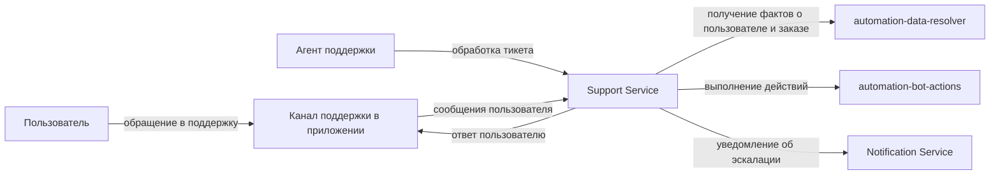
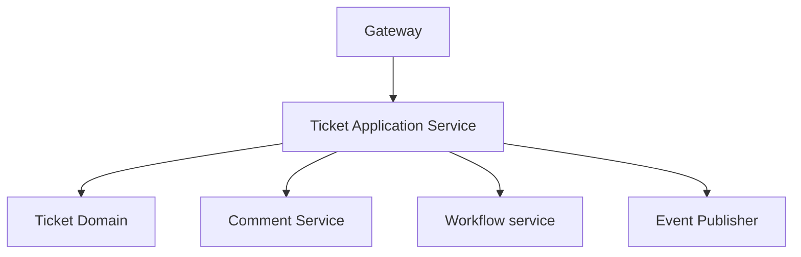
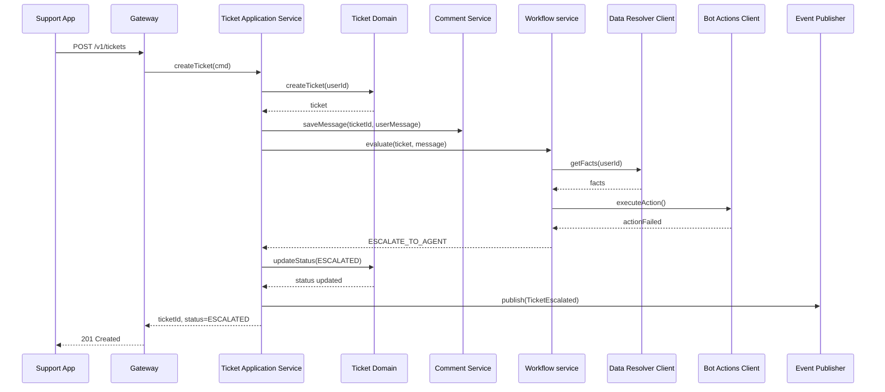

# Лабораторная работа 1 - Декомпозиция и взаимодействие компонентов
## Проект: Сервис поддержки пользователей

## 1. Краткий контекст проекта

Сервис поддержки пользователей управляет тикетами, их жизненным циклом и коммуникацией между пользователем,
чат-ботом и сотрудником поддержки.

Основная цель сервиса - принять обращение пользователя, сохранить его в виде тикета, попытаться обработать его
автоматически и, если это невозможно или нецелесообразно, передать обращение на ручную обработку сотруднику поддержки.

Сотрудник поддержки разбирает эскалированные обращения, уточняет детали у пользователя, меняет статус тикета и
завершает обработку в случаях, когда автоматического сценария недостаточно.

### Участники процесса

- **Пользователь** - отправляет сообщение или запрос в поддержку.
- **Чат-бот** - выполняет первичную автоматическую обработку обращения по сценарию.
- **Агент поддержки** - сотрудник поддержки, который вручную разбирает сложные обращения и завершает обработку тикета.
- **Менеджер поддержки** - настраивает правила маршрутизации, SLA и контролирует качество обработки.

### Жизненный цикл тикета

Для упрощения в работе используется следующий жизненный цикл тикета:

- NEW - тикет создан, но еще не взят в обработку
- IN_PROGRESS - обращение обрабатывается ботом или агентом
- WAITING_USER - для продолжения нужен ответ пользователя
- ESCALATED - обращение передано агенту поддержки
- RESOLVED - проблема решена
- CLOSED - тикет закрыт окончательно

Такой набор статусов достаточно прост для защиты и покрывает типовой процесс поддержки без лишнего усложнения.

### Примеры бизнес-сценариев

#### Позитивный сценарий

Пользователь создает обращение с вопросом: «Где мой заказ?». Сервис создает тикет, запрашивает факты о пользователе и
заказе через automation-data-resolver, определяет, что заказ уже передан в доставку, и бот автоматически отвечает
пользователю без перевода обращения на агента.

#### Негативный сценарий

Пользователь пишет о проблеме, которую нельзя обработать автоматически, либо внешний automation-сервис не может вернуть
достаточно данных. В этом случае обращение эскалируется, тикет переводится в статус ESCALATED, и дальнейшую обработку
берет на себя агент поддержки.

В рамках этой лабораторной предполагается, что обращение в поддержку создает только идентифицированный пользователь.
Анонимные обращения не рассматриваются.

### Что такое факты и экшены в контексте проекта

В проекте автоматизации поддержки используются два важных понятия:

- **Факты** - это структурированные данные, на основании которых бот или workflow принимает решение о дальнейшей
  обработке обращения. Примеры фактов - статус пользователя, наличие активного заказа, последний статус заказа,
  признаки блокировки.
- **Экшены** - это действия, которые бот может инициировать во внешних системах в рамках сценария. Примеры экшенов -
  отвязать телефон, отменить заказ или продлить заказ.

В рамках этой лабораторной сервис поддержки не вычисляет факты сам и не выполняет внешние действия напрямую. Для этого
он использует две внешние интеграции:

- automation-data-resolver - возвращает факты, нужные для автоматического решения
- automation-bot-actions - выполняет разрешенные экшены

## 2. Декомпозиция системы

### Декомпозиция функциональности

1. **Ticket Management**
   - создание и управление состоянием тикета
   - назначение исполнителя
   - закрытие тикета
2. **Comment / History**
   - хранение сообщений, системных комментариев и журнала изменений
3. **Workflow**
   - правила маршрутизации входящих обращений
   - выбор сценария обработки - автоответ, запрос дополнительных данных, эскалация на агента
   - перевод на агента в сложных случаях

### Декомпозиция по владению данными

- **Ticket Management** - хранит и меняет данные тикета
- **Comment / History** - хранит сообщения и историю изменений
- **Workflow** - хранит правила маршрутизации обращений между автоматической обработкой и ручной обработкой агентом

### Декомпозиция по ролям

- **Пользователь** создает обращение, отвечает в существующем тикете и получает результат обработки
- **Чат-бот** пытается автоматически обработать обращение по сценарию
- **Агент поддержки** разбирает эскалированные обращения и переводит тикет в итоговый статус
- **Менеджер поддержки** настраивает правила маршрутизации и контролирует качество обработки

### Декомпозиция по доменам

- **Управление тикетом** - жизненный цикл обращения, статусы, назначение исполнителя
- **История общения** - входящие и исходящие сообщения, аудит изменений
- **Автоматизация** - правила маршрутизации, получение фактов и выполнение экшенов через внешние сервисы

## 3. Обоснование SRP

- Ticket Management отвечает за жизненный цикл тикета и правила перехода статусов
- Comment / History отвечает за сообщения и аудит
- Workflow отвечает за маршрутизацию обращения и автоматическую обработку

У каждого модуля одна основная причина для изменений и зона ответственности.

## 4. C4 - Context Diagram



Пояснение:
- Support Service - рассматриваемая система
- остальные участники и сервисы - внешнее окружение

## 5. Компоненты и ответственность

- Gateway - прием команд от клиентских приложений и внешних систем
- Ticket Application Service - создает тикеты, добавляет сообщения в существующие тикеты, сохраняет историю и запускает дальнейшую обработку
- Ticket Domain - хранит правила жизненного цикла тикета и проверяет, допустим ли переход в новый статус
- Workflow service - выбирает дальнейший путь обработки обращения - автообработка, запрос фактов, выполнение действия или эскалация на агента
- Comment Service - запись сообщений
- Automation Data Resolver Client - получение фактов о пользователе, заказе и других сущностях для сценария
- Automation Bot Actions Client - выполнение внешних действий, которые выбраны в сценарии автоматизации
- Event Publisher - публикация событий

Workflow service не меняет статус тикета напрямую. Он только принимает решение о дальнейшем пути обработки. Сам перевод
тикета в новый статус выполняется через Ticket Domain.

### Ключевые сценарии, которые координирует Ticket Application Service

- создание тикета по первому обращению пользователя
- добавление сообщения в существующий тикет
- сохранение сообщения в историю тикета
- запуск автоматической обработки через Workflow service
- перевод тикета в статус ESCALATED при неуспешной автообработке
- изменение статуса тикета агентом

## 6. C4 - Component Diagram



Пояснение:
- на этой диаграмме показана декомпозиция контейнера Support Service на внутренние компоненты
- Ticket Application Service координирует сценарии
- доменная логика изолирована в Ticket Domain
- внешние интеграции и база не показаны, так как это уровень компонентов одного контейнера

## 7. Интерфейсы и контракты взаимодействия

Ниже используются статусы тикета из жизненного цикла, описанного в разделе 1.

### 7.1 REST

#### `POST /v1/tickets`
Назначение: создать новое обращение пользователя.

Поле channel показывает, из какого канала пришло обращение пользователя. В рамках этой лабораторной используется
значение app - встроенный канал поддержки в приложении.

Для упрощения в рамках первой лабораторной рассматривается один канал:

- app

Расширение на другие каналы можно добавить на следующих этапах проекта без изменения базовой модели тикета.

Request:

```json
{
  "channel": "app",
  "userId": "u-42",
  "text": "Где мой заказ?",
  "sentAt": "2026-03-06T10:00:00Z"
}
```

Response 201:

```json
{
  "ticketId": 9001,
  "status": "IN_PROGRESS",
  "nextAction": "BOT_REPLY"
}
```

Здесь статус IN_PROGRESS означает, что обращение уже принято в обработку системой. Это не означает, что оператор уже
назначен. На первом этапе тикет может обрабатываться ботом, а перевод на оператора происходит только после эскалации.

Ошибки:
- 401 Unauthorized
- 400 Bad Request
- 503 Service Unavailable

#### `POST /v1/tickets/{ticketId}/messages`
Назначение: добавить сообщение в существующий тикет.

Эту ручку могут использовать и пользователь, и агент поддержки. Кто именно отправил сообщение, определяется по
контексту авторизации.

Request:

```json
{
  "text": "Здравствуйте. Проверили заказ, он уже передан в доставку."
}
```

Response 200:

```json
{
  "ticketId": 9001,
  "sentAt": "2026-03-06T10:12:00Z"
}
```

Ошибки:
- 404 Not Found
- 403 Forbidden
- 409 Conflict

Конфликт возможен, например, если тикет уже закрыт и новые сообщения в него больше добавлять нельзя.

#### `PATCH /v1/tickets/{ticketId}`
Назначение: изменить состояние тикета.

Эта ручка используется из рабочего места агента поддержки. Пользователь приложения не меняет статус тикета напрямую
через эту ручку.

Request:

```json
{
  "status": "RESOLVED",
  "reason": "Проблема решена оператором поддержки"
}
```

Response 200:

```json
{
  "ticketId": 9001,
  "status": "RESOLVED",
  "updatedAt": "2026-03-06T10:10:00Z"
}
```

Ошибки:
- 404 Not Found
- 403 Forbidden
- 409 Conflict

Примеры неверных переходов статуса:

- CLOSED -> IN_PROGRESS
- CLOSED -> RESOLVED
- RESOLVED -> NEW

### 7.2 Асинхронное событие TicketEscalated

Это событие публикуется, когда обращение не удалось обработать автоматически и тикет переводится в статус ESCALATED.
Оно отправляется в канал escalated-tickets.
Notification Service читает это событие и отправляет уведомление оператору.

Пример события:

```json
{
   "eventId": 1,
   "eventType": "TicketEscalated",
   "ticketId": 5000071223242,
   "fromStatus": "IN_PROGRESS",
   "toStatus": "ESCALATED",
   "reason": "LowBotConfidence",
   "occurredAt": "2026-03-06T10:02:15Z"
}
```

## 8. Типы взаимодействий

- `Канал поддержки в приложении -> Support Service` — REST
- `Support Service -> Канал поддержки в приложении` — REST
- `Агент поддержки -> Support Service` — REST
- `Support Service -> automation-data-resolver` — gRPC
- `Support Service -> automation-bot-actions` — gRPC
- `Support Service -> Message Broker` — публикация события TicketEscalated в канал escalated-tickets
- `Notification Service <- Message Broker` — чтение события TicketEscalated и отправка уведомления оператору

## 9. Диаграмма последовательностей

Сценарий: создание обращения -> попытка автообработки -> эскалация на агента



На диаграмме показан основной успешный сценарий. Если создать тикет не удалось, ручка POST /v1/tickets возвращает
ошибку и дальнейшая обработка не запускается.

Вызов workflow запускается после того, как сервис создал тикет и сохранил первое сообщение пользователя.

Если обновить статус до ESCALATED не удалось, событие TicketEscalated не публикуется, а ручка возвращает ошибку и
сценарий на этом останавливается.

В этом сценарии пользователь пишет в поддержку по заказу. Workflow пытается обработать обращение автоматически, получает
факты о пользователе и его активном заказе, но не может завершить сценарий без участия сотрудника поддержки. Поэтому
тикет переводится в статус ESCALATED.

## 10. Анализ связности и снижение зацепления

### Анализ связности

- Ticket Domain обладает функциональной связностью, так как отвечает за одну бизнес-функцию - жизненный цикл тикета и
  допустимые переходы статусов
- Comment Service обладает коммуникационной связностью, так как собран вокруг данных сообщений и истории общения
- Workflow service обладает последовательностной связностью, так как шаги автоматической обработки идут в естественном
  порядке и результат одного шага используется на следующем

### Анализ зацепления

- Между Workflow service и automation-data-resolver преобладает data coupling. Workflow запрашивает только факты,
  нужные для принятия решения, и не использует внутренние модели внешнего сервиса
- Более рискованное место - control coupling между Workflow service и automation-bot-actions. Workflow фактически
  управляет тем, какой экшен должен быть выполнен, поэтому расширение набора экшенов может потребовать изменений в
  обоих сервисах

### Предложенные меры

1. Допущение: в рамках этой лабораторной считаем, что основные контракты automation-data-resolver и
   automation-bot-actions уже согласованы и достаточно стабильны. Поэтому отдельные адаптеры не выделяются, а
   Support Service обращается к этим сервисам напрямую
2. Обращаться к automation только через согласованный контракт
3. Зафиксировать набор экшенов в OpenAPI-контракте с использованием enum. Это не позволит незаметно удалять
   существующие экшены и добавлять новые без явного изменения контракта
4. Использовать outbox, чтобы обновление статуса тикета и отправка TicketEscalated не расходились. Если тикет уже
   переведен в ESCALATED, событие об этом должно дойти до брокера
