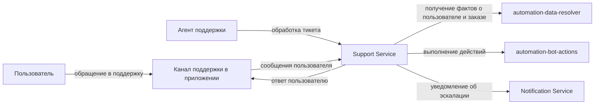
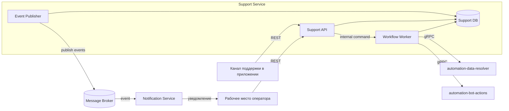

# Лабораторная работа 2
## Сервис поддержки пользователей

## 1. Краткое описание системы

Сервис поддержки пользователей управляет тикетами, их жизненным циклом, SLA и историей коммуникаций.
Канал поддержки в приложении, рабочее место оператора и automation-сервисы считаются внешними системами

Основные продуктовые ожидания:
- расширяемость правил workflow
- прозрачная история тикета

Техническое допущение для архитектуры:
- при временных сбоях событийного контура публикация событий повторяется через retry

## 2. Диаграммы по модели C4

### 2.1 Context Diagram

Пояснение:
- участники: пользователь и агент поддержки
- граница системы: только доменная часть поддержки
- канал поддержки в приложении, automation-сервисы и Notification Service находятся во внешнем окружении
- диаграмма соответствует context level из lab-1 и показывает только систему и ее внешние взаимодействия

### 2.2 Container Diagram

Пояснение:
- Support API принимает команды от канала поддержки в приложении и рабочего места оператора
- Workflow Worker выполняет bot-first обработку и решает, нужно ли эскалировать обращение
- Event Publisher читает outbox записи из Support DB и публикует события в брокер
- Support DB хранит Ticket, Comment, историю изменений и outbox записи
- на контейнерной диаграмме показаны только контейнеры и внешние системы, которые напрямую взаимодействуют с контейнерами Support Service

Допущения:
- outbox хранится в той же БД, что и основные сущности
- доставка событий at-least-once
- для потребителей событий обязательна идемпотентная обработка по eventId
- если внешний потребитель не поддерживает идемпотентность, он не должен подключаться к этому событийному контуру без промежуточной дедупликации

### 2.3 Пояснения к диаграммам для ролей

Для аналитика:
- граница системы проходит по доменной логике поддержки
- внешние акторы и системы отделены от внутренних контейнеров

Для разработчика:
- команды идут через Support API
- workflow-логика и gRPC интеграции вынесены в Workflow Worker
- событийный контур публикации сделан через outbox записи в Support DB, Event Publisher и Message Broker
- Support API в этой лабораторной рассматривается как контейнер, внутри которого находятся компоненты Gateway, Ticket Application Service, Ticket Domain и Comment Service из lab-1
- Workflow Worker соответствует контейнерному уточнению Workflow service из lab-1

## 3. ADR - Доставка доменных событий через Outbox + Broker

### Context

Support Service хранит критичные данные тикета и публикует доменные события во внешние интеграции
Распределённая транзакция между БД и брокером не используется
Нужно гарантировать атомарность доменных изменений и устойчивую доставку событий
Изменение статуса тикета внутри Support Service считается синхронным и является источником истины
Уведомление оператора доставляется асинхронно и может приходить с задержкой относительно момента фиксации статуса в Support Service

### Problem

Как публиковать события так, чтобы:
1. изменение тикета и запись события были атомарны
2. сбой брокера не приводил к потере событий
3. публикация доменных событий не блокировала API-ответ пользователю

### Alternatives

| Вариант | Краткое описание | Плюсы | Минусы |
|---|---|---|---|
| A. Outbox + Broker | запись события в outbox в локальной транзакции и фоновая публикация в брокер | не теряются события при временной недоступности брокера, публикация не блокирует API-ответ, решение хорошо сочетается с асинхронным уведомлением об эскалации | eventual consistency, возможны дубли, нужен мониторинг backlog |
| B. Синхронные REST интеграции | последовательные вызовы внешних систем в рамках одного пользовательского запроса | простая трассировка запроса, нет отдельного контура публикации | ответ API зависит от доступности внешних систем, один сбой ломает весь поток, выше latency |
| C. CDC из таблиц изменений | внешняя публикация событий через процесс чтения изменений БД | слабая связность с прикладочным кодом, публикация событий вынесена из бизнес-логики | сложнее эксплуатация, выше зависимость от конкретной БД и инфраструктуры, сложнее локально контролировать формат доменных событий |

### Decision

Выбран вариант A - Outbox + Broker
Доменные изменения и запись в outbox фиксируются в одной транзакции в Support DB
Event Publisher читает outbox записи, публикует их в брокер и помечает как отправленные

### Consequences

После выбора Outbox + Broker:
- статус тикета и запись о событии фиксируются атомарно внутри Support DB
- пользовательский запрос не блокируется ожиданием публикации события и ответа внешних систем
- внешние потребители получают событие не сразу, а через асинхронный контур
- между внутренним состоянием тикета и внешними системами появляется eventual consistency
- уведомление оператора может прийти позже, чем тикет перейдет в статус ESCALATED
- возможны повторные публикации одного и того же события, поэтому обработчики должны быть идемпотентными
- требуется отдельный мониторинг outbox backlog, ошибок публикации и задержек доставки

Связь с диаграммами и рисками:
- решение реализуется в контейнерной диаграмме через Support DB, Event Publisher и Message Broker
- риск [Р-1](#risk-r1) напрямую связан с выбранной моделью доставки
- риск [Р-2](#risk-r2) связан с отдельным gRPC контуром Workflow Worker -> automation-data-resolver

## 4. Риски и план реагирования

| Риск | Причина | Влияние | План реагирования |
|---|---|---|---|
| Р-1 | outbox работает по ретраям и может повторно отправлять событие | downstream-системы получают событие с задержкой или повторно | идемпотентные обработчики по eventId, мониторинг backlog, алерты на рост непрочитанных outbox записей |
| Р-2 | automation-data-resolver как внешняя система может деградировать по latency или отвечать медленнее ожидаемого | таймауты auto-обработки и рост лишних эскалаций на агента | кэш фактов с TTL, circuit breaker, fallback на частичный набор фактов |
| Р-3 | ошибки в правилах workflow или неполные условия маршрутизации | перегрузка агентов или поздняя передача сложных кейсов человеку | версионирование правил, аудит причин эскалации |

## 5. Архитектурный компромисс

Компромисс: низкая задержка API vs строгая синхронная консистентность событийных интеграций

| Критерий | Асинхронная модель Outbox + Broker | Синхронная модель REST orchestration |
|---|---|---|
| Время ответа API | низкое и стабильное | зависит от доступности внешних систем |
| Консистентность между системами | eventual consistency | сильная в рамках запроса |
| Устойчивость к сбоям интеграций | высокая за счёт очереди и ретраев | ниже, один сбой ломает весь поток |
| Сложность отладки | выше из-за асинхронного пайплайна | ниже, один сквозной trace |

Выбор сделан в пользу асинхронного подхода.

Для домена поддержки важнее предсказуемый отклик API и устойчивость к сбоям внешних интеграций

## 6. Связи между артефактами

- контейнерная диаграмма реализует решение ADR через outbox записи в Support DB, Event Publisher и Message Broker
- риск [Р-1](#risk-r1) напрямую покрывается выбранным решением Outbox + Broker
- риск [Р-2](#risk-r2) связан с зависимостью Workflow Worker от automation-data-resolver
- компромисс по консистентности объясняет асинхронный интеграционный контур
